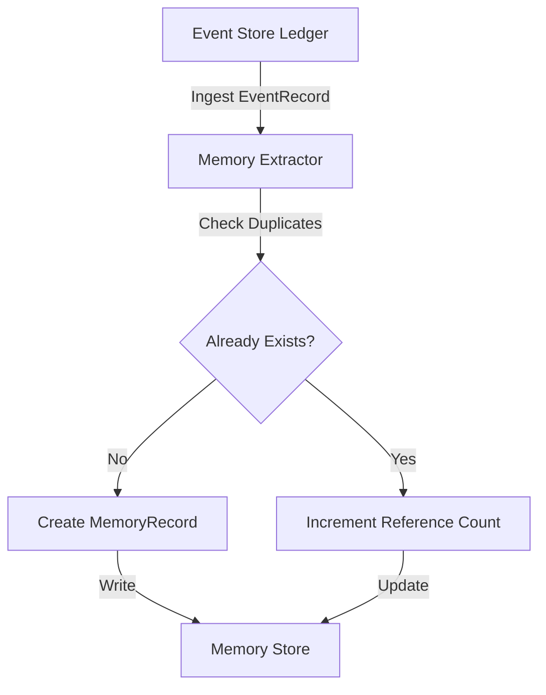
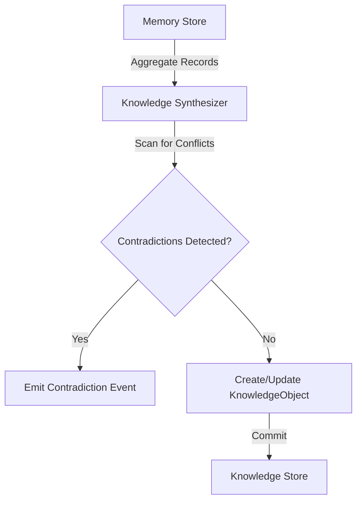
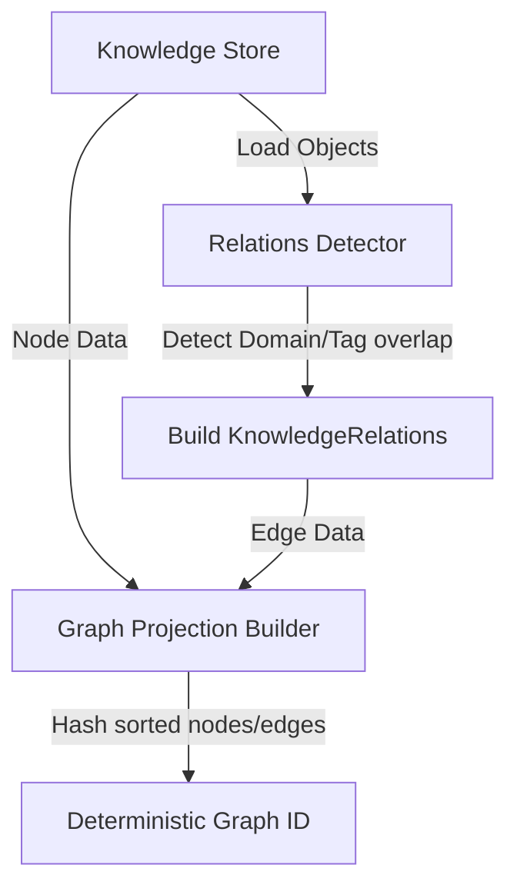
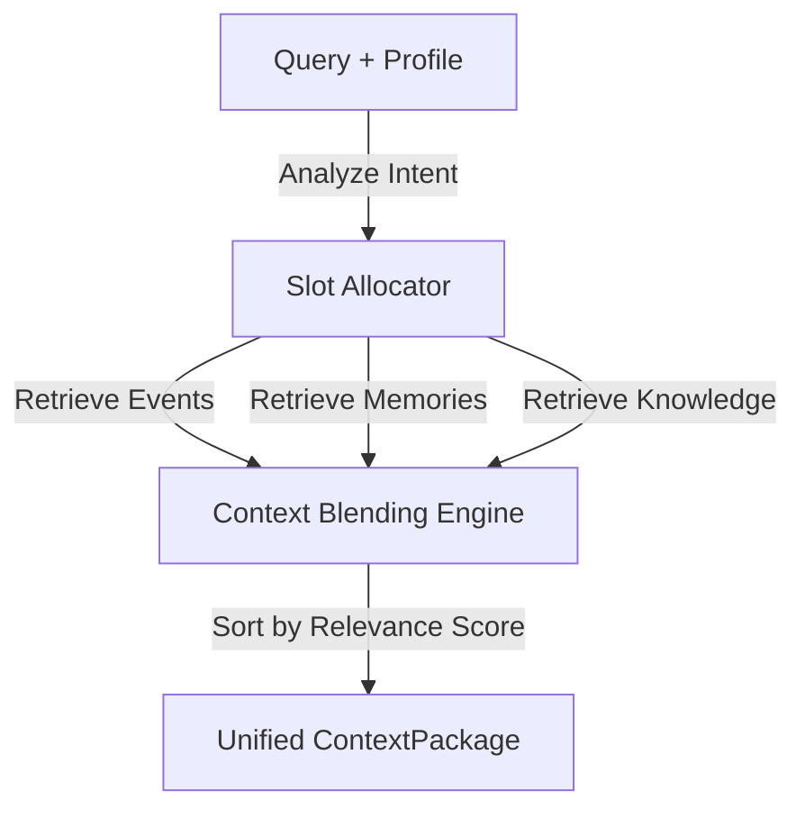
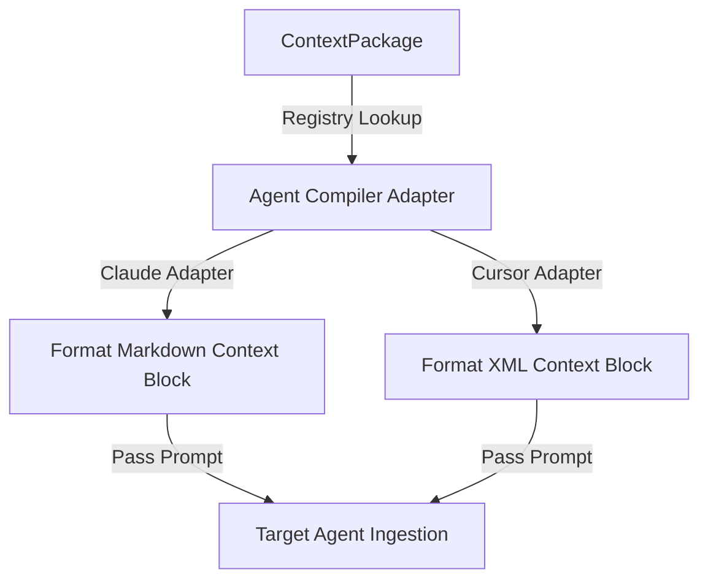

# Relay Architectural Architecture

This document details the data transitions, pipelines, and projections that drive Relay's cognitive memory framework.

---

## Complete Evolutionary Flow

Relay tracks project status by processing data through a sequence of projections:

```text
Event Stream
  ↓  (Memory Extraction & Deduplication)
Memory Store
  ↓  (Knowledge Synthesis & Contradiction Checking)
Knowledge Store
  ↓  (Semantic Relations & Topological Projection)
Knowledge Graph
  ↓  (Profile Blending & Slot Allocation)
Context Package
  ↓  (Prompt Formatting & Adapter Registries)
Agent Compiler Output
```

---

## Layer-by-Layer Projections

### 1. Events → Memories
Events are captured in the immutable ledger. When an event is appended, memory extraction rules parse it, check for duplicates, and record corresponding memory records.



### 2. Memories → Knowledge
Memory records are synthesized into high-level, declarative knowledge objects (project invariants, architectural decisions) while analyzing for contradictions.



### 3. Knowledge → Graph
Knowledge objects and detected semantic relationships are projected into a topological knowledge graph projection.



### 4. Graph → Context
Using the query keywords and the target profile (e.g. `DECISION_LOOKUP`), Relay determines source weights and retrieves items into slots.



### 5. Context → Compiler → Agent
The unified context package is passed to the compiler registry where adapter-specific formatting prepares the prompt context block for a target LLM.


