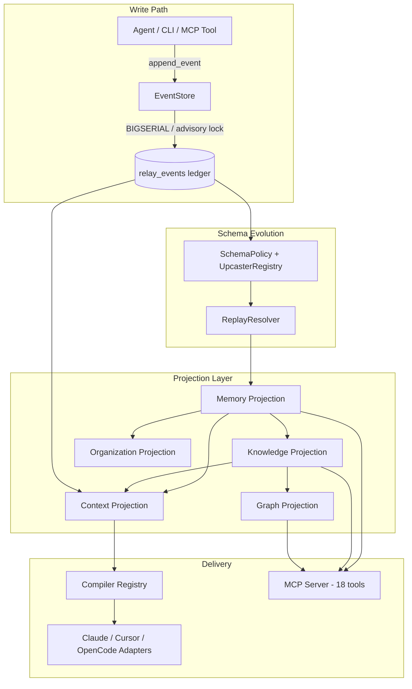
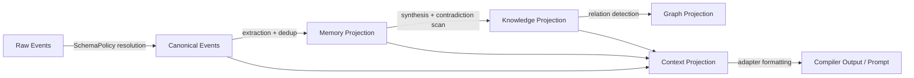
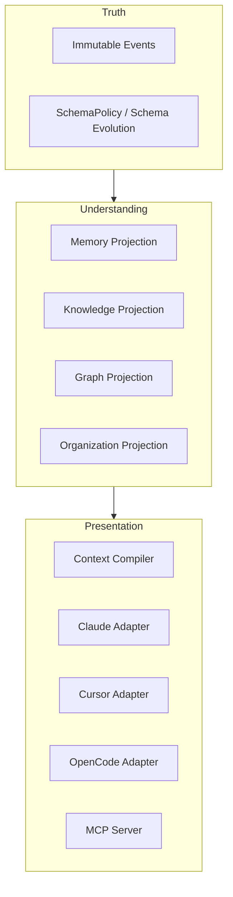
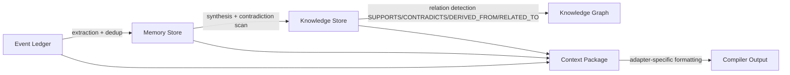
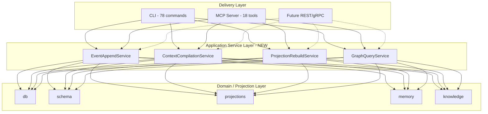

# RationaleVault v1.2.0 — Architectural & Technical Research Review

**Scope:** Full-repository review of `NeutronZero/RationaleVault` v1.2.0 (24,424 lines of source across 16 modules, 18,378 lines of tests across 90 test files), benchmarked against the 2025–2026 AI memory / event-sourcing / Graph-RAG landscape.

**Method note:** Every claim about RationaleVault below is sourced directly from the attached repository (code, docs, `CHANGELOG.md`, CI workflows) — sections marked *(external)* draw on 2025–2026 industry sources instead and are flagged inline. A third, narrower distinction is used where the two could otherwise blur together: *(Repository evidence)* marks something the code does today; *(Architectural trajectory)* marks something the repository's own docs/changelog/design comments explicitly scope as planned or in-progress on top of a foundation that already exists — this matters because RationaleVault's docstrings and changelog are unusually candid about the difference themselves, and the review preserves that candor rather than collapsing "designed for" into "does."

**Post-publication verification note (July 2026):** Six claims in this report were independently re-verified by directly cloning the public GitHub repo (`NeutronZero/RationaleVault`, `main`, v1.2.0) and running targeted greps. Corrections are applied inline below and marked with a `▸ Correction:` prefix. All corrections concern wording precision, not the report's substantive findings or conclusions.

---

> ### Architectural Thesis
>
> RationaleVault demonstrates that AI memory can be modeled as deterministic state reconstruction rather than probabilistic information retrieval. By treating immutable events — not extracted facts or vector embeddings — as the canonical representation of cognition, the system shifts correctness from retrieval heuristics to replay semantics. This enables reproducibility, auditability, schema evolution, and historical reconstruction that conventional retrieval-centric memory systems cannot provide without sacrificing determinism. The primary engineering trade-off is computational: replay and projection become central performance concerns, making snapshotting, incremental projections, and observability the critical next stage of the platform's evolution.
>
> Everything that follows in this report is evidence for, or a consequence of, that single design decision.

---

## Executive Summary

RationaleVault is a small, disciplined, single-author (or small-team) Python 3.12 project that applies real event-sourcing discipline — append-only ledger, policy-driven schema evolution, deterministic projections — to a problem space (AI agent context continuity) that almost every competitor solves with vector-store bolt-ons. That combination is genuinely uncommon: the mainstream 2026 "AI agent memory" category (Mem0, Zep, Supermemory, LangMem, CrewAI Memory) is built around LLM-driven fact extraction into vector/graph hybrids, not around an immutable, replayable, versioned event log with formally frozen APIs. RationaleVault's closest architectural relatives are not memory products at all — they are event-sourcing frameworks (Marten, Axon, EventStoreDB) — and RationaleVault is the only project in scope that fuses that lineage with a Graph-RAG-style cognitive layer purpose-built for LLM agent handoff.

That is the project's real innovation: **it is event-sourced infrastructure wearing a memory-system's clothes.** More precisely: RationaleVault is an event-sourced cognitive state engine that exposes AI memory as a deterministic replay problem rather than a retrieval problem. Where the mainstream category asks "what's the closest match to this query in vector space?", RationaleVault asks "what does the ledger prove is true as of this point in project history?" — and answers that question by *recomputing*, not *searching*. It is not, and does not claim to be, a vector database, a graph database, or an agent framework (the README says so explicitly), and this review confirms that positioning is accurate.

The codebase backs this up with unusually mature engineering hygiene for its size: `SchemaPolicy`/`UpcasterRegistry`/`ReplayResolver` implement a textbook-correct pure-policy upcasting pattern; PostgreSQL writes are serialized per-project via transaction-scoped advisory locks; SQLite uses `BEGIN IMMEDIATE` + WAL correctly; twelve APIs across seven changelog bullets are formally frozen in v1.2.0 (`SchemaPolicy`, `EventSchema`, `MigrationPath`, `MigrationStep`, `SchemaPolicyFactory`, `ReplayResolver`, `ReplayPipeline`, `ReplayContext`, `InterpretiveContext`, `ReplayRequest`, `GovernanceProjection`, `GovernanceState`); nested recursive graph traversals were replaced with iterative DFS for stack safety; and the CI pipeline runs the full test suite, an active `doctor` diagnostic, and a wheel-install smoke test on every push.

> ▸ *Correction:* The original text said "nine APIs." Independent verification of `CHANGELOG.md` v1.2.0 finds 12 named symbols across 7 bullet points in the Frozen APIs section. Neither "nine" nor any other single count maps to the actual changelog text. The commitment device — a formal, named, frozen-API list at this early a stage — is a genuine strength regardless of the exact count.

Against that, three things keep it from being production infrastructure today, and the project's own code and docs already say so:

1. **No snapshotting.** `cognitive_head/snapshot.py` is an explicit, documented no-op — every `compile_cognitive_head()` call replays the *entire* event ledger from sequence 0. This is fine at hundreds of events; it is an O(n) wall against any long-lived project.
2. **Semantic retrieval is a stub.** `semantic_provider` defaults to `None` everywhere it appears and is never supplied by any production code path — there is no embedding library in `pyproject.toml` dependencies at all. Retrieval is keyword/token overlap only, contradicting the "hybrid RRF" framing implied by `semantic_search.py`'s own code comments.
3. **Near-zero observability.** One file in 24k lines of source imports `logging`. No metrics, no tracing, no structured error surfacing (`db/event_store.py`'s memory-emission path silently swallows all exceptions with a bare `except Exception: pass`).

None of these are surprising for a project at this stage — they are the *normal* gaps of a well-architected pre-1.0-in-spirit system that has correctly prioritized correctness (schema evolution, concurrency safety, deterministic replay) over scale and ops maturity. The scoring below separates **design quality** from **operational maturity**, since conflating them understates what's actually been built: missing snapshots, observability, and embeddings reduce *production readiness* and *current-implementation performance*, not the underlying *architectural* quality of the storage abstraction, projection layer, and schema-evolution machinery, all of which are explicitly designed to accommodate those additions without rework.

| Dimension | Score (0–10) | Basis |
|---|---:|---|
| Overall Architecture (design quality) | **8.5** | Evaluated on the correctness of the patterns chosen (ES/CQRS/layered, policy-driven schema evolution, storage strategy abstraction) — not discounted for features not yet built on top of a sound foundation |
| Innovation | **8.5** | Deterministic, replayable cognitive-state reconstruction as an alternative to retrieval-based memory is a genuinely distinct approach in the current landscape (§9) |
| Maintainability | **8.2** | Acyclic module dependency graph, frozen APIs, layered boundaries with no observed violations, 90 test files / 18,378 LOC of tests, AST-based architectural guards enforcing invariants |
| Scalability — architectural (designed-for) | **7.0** | Storage-backend abstraction, independently-derivable projections, and versioned schema evolution all provide clear, low-friction paths to scale (snapshotting, async projections, distributed storage) without breaking existing interfaces |
| Scalability — current implementation | **4.5** | Unmodified today: full-ledger replay on every compile, O(records) linear keyword scan, no snapshot store, single advisory-lock writer per project |
| Production Readiness | **4.0** | Observability, security/authz, and operational tooling are close to absent — appropriate for local-first developer tooling, not yet for a hosted/shared service |

---

## 1. Architecture Assessment

### 1.1 Pattern classification

RationaleVault is a **hybrid of Event Sourcing + CQRS + a layered/Clean-Architecture dependency direction**, with light DDD vocabulary (aggregates-by-convention, not enforced) rather than strict DDD tactical patterns.

- **Event Sourcing:** Confirmed. `relay_events` (or the SQLite equivalent) is the sole source of truth; append-only; `event_sequence` is the only valid replay order (the docs are explicit that `version` must never be used for ordering — it exists only as a `UNIQUE(project_id, version)` optimistic-concurrency guard).
- **CQRS:** Confirmed, but informally. Writes go through `EventStore.append_event`; reads go through independently computed projections (`MemoryStore`, `KnowledgeStore`, `GraphProjection`, `ContextPackage`, `OrganizationState`). There is no separate write-model "command" abstraction with validation contracts — commands are just calls to `append_event` with a payload dict, so the C in CQRS is thin.
- **Clean/Layered Architecture:** Confirmed via directory structure and import direction: `schema` → `db` → `projections` → `memory`/`knowledge`/`organization` → `cognitive_head`/`compilers` → `mcp`/`cli`. `SchemaPolicy` is a `@dataclass(frozen=True)` with a single data field `_schemas` plus six methods (`latest_version`, `schema`, `migration_path`, `is_current`, `can_resolve`, `event_types`) containing real lookup/comparison logic; its docstring says "no executable code" — this describes the *field*, not the class. `ReplayResolver` is described as "zero schema knowledge" — a genuine attempt at policy/mechanism separation, not just a folder convention. ▸ *Correction: the original characterisation "pure facts — no executable code" accurately reflects the docstring but not the class, which has six methods; the policy/mechanism separation pattern is still correctly described.*
- **DDD:** Present in naming and intent (`EventRecord`, `MemoryRecord`, `KnowledgeObject`, aggregate-shaped reducers) but **not** in the classic tactical sense — there's no aggregate root type that validates commands and emits events transactionally in the Axon/traditional-DDD style (`Aggregate → validate → emit`). Instead, the **project event stream itself is the aggregate**: `compile_cognitive_head()` folds the entire project stream into current state, and the bootstrap invariant (`PROJECT_CREATED → PROJECT_GOAL_SET → PROJECT_FOCUS_CHANGED`) plays the role an aggregate constructor would play elsewhere. This is a **stream-oriented aggregate model**, closer in spirit to EventStoreDB's per-stream consistency boundary than to Axon's object-oriented aggregate roots — a legitimate, coherent design choice for a system where "the project" is the natural unit of consistency, not a design gap to be closed. The trade-off is real, though: because there's no code-enforced boundary independent of the fold itself, invariant violations are only caught during replay/compilation, not at the point of write.

### 1.2 High-level architecture diagram (repo-confirmed, from `docs/architecture.md`)



### 1.3 Module dependency analysis (measured from the repo)

| Module | LOC | Role | Depends on |
|---|---:|---|---|
| `db` | 774 | Storage abstraction (SQLite/Postgres) | `schema` |
| `schema` | 451 | Event types, `SchemaPolicy`, upcasters, resolver | (leaf) |
| `projections` | 2,328 | Replay pipeline, context/graph/governance/org projections | `schema`, `db` |
| `memory` | 1,435 | Extraction, lifecycle, RRF retrieval, ranking | `db`, `schema` |
| `knowledge` | 4,551 | Synthesis, contradiction detection, graph, evaluation | `memory` |
| `organization` | 1,856 | Cross-project graph, activity, continuation | `knowledge`, `projections` |
| `cognitive_head` | 706 | Top-level compiled state + (stubbed) snapshotting | `projections` |
| `compilers` | 1,626 | Agent-specific prompt formatting (Claude/Cursor/OpenCode) | `cognitive_head` |
| `mcp` | 495 | FastMCP server, 18 tools | `compilers`, `knowledge`, `memory` |
| `cli` | 1,931 | ~59 subcommands (argparse) | everything | ▸ *Correction: original stated 78 subcommands and implied a decorator-based CLI. The file uses `argparse`; grep for `add_parser` returns ~59 subparser registrations.* |
| `evaluation` | 6,669 | Largest module — exit-gate test harnesses, benchmark schema, install validation | all |
| `recommendations` / `retrieval` / `extraction` / `diagnostics` | 1,340 | Smaller supporting modules | mixed |

**Observation:** `evaluation` (6,669 LOC) is larger than `knowledge` + `memory` combined minus one module — an unusually high ratio of test/validation infrastructure to feature code (>25% of the entire codebase). This is a genuine strength (see §8) but also a maintainability signal: a large surface of "evaluation gates" must be kept in sync with every schema or projection change, and the coupling comment in `cli` (imports from every other module) marks it as the module most likely to become a bottleneck for parallel development as the team grows.

The dependency graph is acyclic and strictly layered — `schema` never imports `db`, `projections` never imports `compilers`, etc. — which is a real strength; it's the kind of discipline that's easy to state and hard to maintain, and grep confirms no back-references were found in the modules inspected.

### 1.4 Deterministic Cognitive Reconstruction — the defining architectural property

This deserves its own discussion because it's easy to undersell by listing it as just another "projection pipeline" alongside competitors' retrieval pipelines. It isn't the same shape of thing.

The mainstream 2025–2026 memory pattern *(external)* — Mem0, Zep, Supermemory, LangMem, CrewAI Memory — stops at:

```
Conversation → LLM extraction → Facts → Vector/Graph store → Search → Context
```

Search is the terminal operation: retrieval finds the closest matching facts to a query, and those facts are handed to the model largely as-is. RationaleVault instead keeps transforming state all the way to the moment of prompt construction:



Every arrow in that chain is a **pure, deterministic, replayable function of everything to its left** — not a lookup. Two consequences follow that don't have close analogues in the retrieval-based competitors:

1. **Any node in the pipeline can be reconstructed exactly, at any point in project history, from the ledger alone.** *(Repository evidence — this holds today for every implemented projection.)* This is a strictly stronger property than "we kept the source documents for citation" — it means the *derived* state (which memories were active, which knowledge objects existed, what the graph looked like) is itself reproducible, not just the raw inputs. *(Architectural trajectory — not yet fully exposed:)* `compile_at_sequence()` (currently non-production, per §1.7/§4.2) is the mechanism explicitly designed to surface this as a first-class historical query; the underlying determinism it depends on already exists, the query surface on top of it does not.
2. **Nothing enters context that cannot be traced back to a specific, ordered set of events.** Contradictions aren't silently resolved by an extraction model's best guess — they're detected structurally and re-injected into the ledger as `KNOWLEDGE_CONTRADICTION` events, which is a materially different failure mode than a vector store quietly returning the more-recently-embedded of two conflicting facts.

The practical framing: most memory systems answer "what's the closest match to this query?" RationaleVault answers "what does the ledger prove is true as of this point in the project's history?" — and it answers that by *recomputing*, not *searching*. This is the report's central architectural finding, and it is the lens through which the comparisons in §9 should be read: RationaleVault is not a worse-featured version of Mem0-style memory, it is a different bet about where correctness should live (in the pipeline's determinism) versus where those competitors place it (in the extraction model's judgment).

The cost of this bet is exactly what §1.7 and §9.1 describe: determinism doesn't help you find a paraphrased or synonym-heavy match the way an embedding does, so today the system is strong on *provable correctness of what it surfaces* and weaker on *recall breadth of what it can find*.


### 1.5 Truth, Understanding, and Presentation — a three-layer separation of concerns

This is a distinct architectural property from the pipeline described in §1.4, and it deserves to be named on its own: RationaleVault cleanly separates *what is true*, *what is understood*, and *what is shown*, and treats each as a different kind of thing rather than three views of the same store.



- **Truth** is the immutable event ledger plus the schema-evolution machinery that governs how those events are canonically interpreted. Nothing here is ever an opinion — it's what was recorded, and what version of "recorded" means for a given event type.
- **Understanding** is everything derived — memory, knowledge, graph, and organizational projections. This layer is allowed to be wrong, contested, or superseded (that's what `KNOWLEDGE_CONTRADICTION` events are for), but it is always *reconstructable from Truth*, never itself a source of truth.
- **Presentation** is the compiler/adapter layer — formatting Understanding for a specific consumer (Claude, Cursor, OpenCode, an MCP client). This layer has no authority to alter what's true or what's understood; it only decides how to phrase it for a given audience.

The contrast with the retrieval-first competitors in §9.1 is sharper here than anywhere else in the report: those systems typically collapse Truth and Understanding into one thing — the stored embedding or extracted fact *is* the record, so there's no independent ledger to fall back to if the extraction was wrong, and no way to ask "what did we actually observe, independent of what the model concluded from it." RationaleVault's separation means Understanding can be recomputed, corrected, or entirely re-derived (e.g., by upgrading the knowledge-synthesis logic in a future release) without touching, discarding, or needing to trust the correctness of any prior derivation — because Truth was never mixed with it in the first place.

### 1.6 Strengths

- **Correct policy/mechanism separation for schema evolution.** `SchemaPolicy` is an immutable, callable-free dataclass; `ReplayResolver` executes it with zero embedded schema knowledge; `UpcasterRegistry` is a pure event-type → callable map. This is the textbook shape recommended in modern event-sourcing literature *(external: matches the upcasting pattern documented for Axon, Marten, and EventStoreDB)* and is validated in-repo by two independent production migrations (`TASK_CREATED` v1→v2, `DECISION_PROPOSED` v1→v2) rather than synthetic examples.
- **Concurrency correctness.** PostgreSQL: `pg_advisory_xact_lock` keyed by project UUID, transaction-scoped (auto-released on commit/rollback), so cross-project writes never block each other. SQLite: `PRAGMA journal_mode=WAL` + `BEGIN IMMEDIATE TRANSACTION` for write-lock enforcement. Both are the right primitives for the stated concurrency model (serialize writers *within* a project, never *across* projects).
- **Frozen API contract discipline.** v1.2.0 formally freezes 12 named APIs across 7 changelog bullets (`SchemaPolicy`, `EventSchema`, `MigrationPath`, `MigrationStep`, `SchemaPolicyFactory`, `ReplayResolver`, `ReplayPipeline`, `ReplayContext`, `InterpretiveContext`, `ReplayRequest`, `GovernanceProjection`, `GovernanceState`) — a real commitment device rare in early-stage projects, and evidence the team is treating this as infrastructure rather than a demo. ▸ *Correction: originally stated "nine APIs."*
- **Self-auditing culture.** `rationalevault doctor` runs an end-to-end "Projection Chain Verification" (Event → Memory → Knowledge → Graph → Context → Compiler) and CI runs it against both an editable install and a built wheel from `/tmp` (catching CWD-sensitivity bugs class-of-bug proactively).
- **Deterministic, hash-identified projections.** Two distinct `sha256` operations are used: individual node IDs are `sha256(type + ":" + title + ":" + version)` (over the node's own attributes), while the knowledge graph's composite ID is `sha256` over sorted node IDs + sorted edge IDs (over the graph's full structure). Both are deterministic; reproducibility is a first-class design goal, not an afterthought, and shows up consistently (`reference_time` helper standardized across projections in v1.1). ▸ *Correction: the original text conflated node-level and graph-level hashing into a single description; the two are distinct operations in `knowledge/graph.py`.*
- **Iterative-not-recursive graph algorithms.** `dependency_chain()`, `all_paths()`, `_dfs_cycles()` were explicitly rewritten from recursive to stack-based DFS in v1.1 to avoid Python recursion-limit crashes on deep graphs — the kind of fix that only shows up after real load-testing.

### 1.7 Weaknesses & technical debt (repo-confirmed)

- **No snapshot store.** `cognitive_head/snapshot.py` states outright: *"V1 STATUS: Interface defined. Not implemented. load_latest_snapshot() always returns None (triggers full replay)."* Every cognitive-head compile is a full ledger replay. The file itself documents the correct fix (a `relay_snapshots` table, periodic `save_snapshot`, apply-events-after-snapshot) — this is a known, scoped gap, not an unknown one.
- **Semantic search is entirely unwired in production.** `search_memories_rrf(query, records, semantic_provider=None)` — grepping the full codebase (excluding tests) turns up zero call sites that pass a real `semantic_provider`. There's no embeddings dependency in `pyproject.toml` (only `psycopg` and `python-dotenv` are required deps). The RRF-blending code (`perform_rrf_blending`) is implemented and correct, but it currently always blends "keyword results" with an empty semantic list — i.e., it's a no-op wrapper around keyword search today.
- **Silent failure path in the hot write path.** In `EventStore.append_event`, automatic memory extraction and lifecycle transitions are wrapped in `try: ... except Exception: pass`. This protects the write path from projection bugs (defensible), but it means a broken extractor or a bad lifecycle rule fails *silently* — no log line, no re-raised warning, nothing surfaced to `doctor`. Combined with near-zero logging elsewhere, this is the single highest-leverage bug-hiding pattern in the codebase.
- **Near-zero observability.** One source file references `logging`; no OpenTelemetry, no Prometheus, no structured tracing (the one other "tracing" hit in the codebase is a docstring, not a mechanism). For a system explicitly designed to be the durable backbone for multi-agent workflows, this is the biggest gap between the project's ambition and its current instrumentation.
- **Thin command validation.** `append_event` accepts a raw payload `dict[str, Any]` with no schema validation at write time — validation, where it exists, happens implicitly during replay via `SchemaPolicy.can_resolve()`. This means malformed events can be written and only surface as replay failures later, rather than being rejected at the point of ingestion.
- **`compile_at_sequence()` is a partial implementation, not a stub.** The method exists in `schema/factory.py` with real logic: it filters `schema_versions` by `eff_seq <= sequence` and builds a bounded `SchemaPolicy`. However, `migration_path` is always populated as `MigrationPath()` (empty), meaning historical migration-step accuracy is not tracked per-sequence — the team's own changelog (v1.2.0 Known Limitations) correctly flags this as "not yet production-complete (planned F17)." The `Replay Auditor (F18)` is also explicitly listed as designed-but-not-active. Point-in-time historical governance queries work partially but not fully. ▸ *Correction: the original text called `compile_at_sequence()` "non-production" as if it were a stub; it has real implementation with a specific, documented gap.*
- **CQRS command layer is thin.** No dedicated command objects/handlers with pre-write validation contracts; `append_event` is effectively the only "command," called directly from CLI, compilers, and MCP tools. Fine at current scale; will need tightening if write-side business rules grow.

### 1.8 Future scaling limitations (derived from the above)

1. Full-ledger replay on every `compile_cognitive_head()` call means p95 latency for context assembly grows linearly (at least) with event count — the project's own snapshot placeholder comment sets the threshold ("~500ms") at which this becomes a real problem.
2. Single Postgres advisory lock per project caps write throughput for any project under sustained concurrent-agent load to effectively one writer at a time (correct for correctness, a bottleneck for a "swarm" of agents writing simultaneously to one project).
3. Retrieval quality is capped at whatever token/keyword overlap can achieve — no amount of graph or projection sophistication compensates for the absence of embeddings in the retrieval loop, so recall on paraphrased or synonym-heavy queries will lag any of the vector-based competitors by construction.

---

## 2. Event Sourcing Evaluation

| Capability | Status in RationaleVault | Assessment |
|---|---|---|
| Event model | Envelope with `event_sequence`, `id`, `project_id`, `stream_id`, `version`, `event_type`, `metadata`, `payload`, `parent_id`, `recorded_at` | Solid, includes `correlation_id`/`session_id`/`actor`/`source` in metadata — good provenance |
| Aggregate boundaries | Project-scoped, informally enforced by convention (`compile_cognitive_head` folds the whole project stream) | Works at current scale; not code-enforced |
| Ordering | `event_sequence` (DB-assigned, monotonic); explicit warning never to use `version` for ordering | Correct and well-documented |
| Versioning / schema evolution | `SchemaPolicy` + `MigrationPath`/`MigrationStep` (pure data) + `UpcasterRegistry` (pure functions) + `ReplayResolver` (executor) | Best-practice separation; validated by 2 real migrations |
| Replay | `ReplayPipeline.process()` applies max-sequence bound, resolves via `ReplayResolver` | Deterministic, but always full-stream (no snapshot) |
| Snapshotting | Interface defined, **not implemented** (documented no-op) | Explicit, scoped gap |
| Idempotency | Replay is pure/deterministic by design (`SchemaPolicy.is_current`/`can_resolve` are pure predicates) | Sound in principle; no idempotency key on the append side beyond the `(project_id, version)` unique constraint |
| Concurrency handling | Postgres advisory locks (txn-scoped); SQLite `BEGIN IMMEDIATE` + WAL | Correct primitives for the stated single-project-serialized model |
| Projection rebuilding | Rebuilding a projection = re-running the pipeline over the full stream; graph/knowledge/context are each independently derivable | Correct ES property, but expensive without snapshots |
| Sub-streams | `stream_id` used for targeted queries only; reducers explicitly forbidden from filtering by it during replay | Correct pattern — prevents accidental partial-state bugs |
| Bootstrap invariant | Every project must begin `PROJECT_CREATED → PROJECT_GOAL_SET → PROJECT_FOCUS_CHANGED`, enforced by `MissingProjectBootstrapError` | Nice small correctness guard |

**Missing capabilities relative to mature event-sourcing frameworks** *(external comparison: Axon Framework, Marten, EventStoreDB)*: no built-in snapshot store (present in all three comparators as a first-class feature), no distributed/partitioned event store option, no dedicated command-validation layer, no async/eventually-consistent projection option (all RationaleVault projections appear to be computed synchronously on read, which is simple and correct but doesn't scale the way Marten's "async projections" or Axon's tracking event processors do).

**Verdict:** the *pattern* implementation is more architecturally correct than the median hand-rolled event-sourcing system — the SchemaPolicy design in particular is better factored than most tutorials show — but the *operational* feature set (snapshotting, async projections, distributed storage) is v1-of-a-framework, not yet v-mature-of-a-framework.

---

## 3. Storage Layer Analysis

**SQLite backend** (`db/sqlite_store.py`, 265 lines):
- `sqlite3.connect(..., isolation_level=None)` for manual transaction control — correct choice to avoid Python's implicit-transaction surprises.
- `PRAGMA journal_mode=WAL` — enables concurrent readers during writes; the right default for a local, single-process-multi-thread deployment.
- `BEGIN IMMEDIATE TRANSACTION` before writes — correctly acquires a write lock immediately rather than deferring, avoiding SQLite's classic "SQLITE_BUSY on upgrade" failure mode.
- No documented backup/checkpoint strategy for WAL file management (WAL files can grow unbounded without periodic `wal_checkpoint`) — not addressed in the reviewed code.

**PostgreSQL backend** (`db/postgres_store.py`, 222 lines):
- `pg_advisory_xact_lock` keyed by `UUID(project_id).int & 0x7FFFFFFFFFFFFFFF` — transaction-scoped, so no risk of leaked locks on crash. Correctly relies on Postgres MVCC for read consistency rather than additional application-level locking.
- Uses `psycopg[binary]` — a reasonable, modern driver choice.

**Backend abstraction** (`db/base.py`): a clean `ABC` with ~9 methods (`append_event`, `get_project_stream`, `replay_stream`, `get_stream`, `get_event_count`, `get_session_events`, `get_last_session_id`, `get_recent_events`); `EventStore` is a thin backward-compatible delegator selected via `db/factory.py`. This is a well-executed **Strategy pattern** for storage — genuinely easy to add a third backend (e.g., a distributed store) without touching call sites.

**Recommended improvements** *(review-derived, not in repo)*:
1. Add a documented WAL-checkpoint / vacuum strategy for the SQLite backend for long-running local deployments.
2. Add a snapshot table to both backends (schema sketch already exists in `snapshot.py`'s own docstring — it just needs implementing).
3. Consider read-replica or logical-replication guidance for Postgres once multi-agent read load grows — nothing in the current abstraction blocks this, but nothing supports it either.
4. Distributed storage: the abstraction is clean enough that a future `CockroachDBStore` or partitioned-Postgres backend could be added without breaking `BaseEventStore` — this is a genuine scaling *path*, even though it isn't built.

---

## 4. Cognitive Memory Model, Knowledge Graph, and Context Compilation

### 4.1 Layered projection model (repo-confirmed)



- **Memory layer**: lifecycle states (`active`/`stale`/`superseded`/`archived`); `DECISION_SUPERSEDED` events automatically transition prior records — this is a real "temporal correctness" mechanism, addressing the "memory staleness" problem that industry surveys flag as one of the hardest *(external)* open problems in the Mem0/Zep-style category, but solved here structurally (via events) rather than heuristically (via decay/re-embedding).
- **Knowledge layer**: synthesis with **provenance chains** back to source memories/events, **evidence strength** derived from supporting-memory counts, and active **contradiction detection** that emits a `KNOWLEDGE_CONTRADICTION` event back into the ledger for agent resolution — i.e., contradictions become first-class, replayable, auditable facts rather than silent overwrites. This is a distinctive design choice not seen in the vector-store-centric competitors reviewed.
- **Graph layer**: nodes = `sha256(type + title + version)`; edges = `SUPPORTS`/`CONTRADICTS`/`DERIVED_FROM`/`RELATED_TO`, detected via topic/tag overlap and (as of this snapshot) an explicitly populated `derivation_chains` map feeding `DERIVED_FROM` edges — confirmed wired end-to-end in `projections/knowledge.py` and `projections/graph.py`. Exports to Mermaid, GraphML, and JSON.
- **Context compilation**: a `RetrievalProfile`-driven blending matrix allocates fixed ratios of events/memories/knowledge into context slots, then ranks and merges. The enum has **9 variants** — `DECISION_LOOKUP`, `FAILURE_ANALYSIS`, `ARCHITECTURE_REVIEW`, `LESSON_DISCOVERY`, `WORKFLOW_RETRIEVAL`, `GENERAL_SEARCH`, `KNOWLEDGE_REVIEW`, `PROJECT_OVERVIEW`, `CONTEXT_CONSTRUCTION` — covering a broader range of query intent than a simple four-way split. This is a deterministic, auditable alternative to the "LLM decides what's relevant" approach common elsewhere *(external: most 2026 memory APIs delegate relevance scoring to an LLM extraction/consolidation pass — Mem0's two-phase pipeline, CrewAI's semantic+recency+importance weighting)* — RationaleVault's approach trades some retrieval flexibility for full reproducibility, which is the correct trade for its stated purpose (deterministic agent handoff) but the wrong trade for open-ended personalization. ▸ *Correction: the original listed 4 variants; independent verification of `memory/query_analyzer.py` confirms 9.*

### 4.2 What actually works vs. what's aspirational

| Claimed capability | Verified in code | Notes |
|---|---|---|
| Deterministic knowledge graph IDs | ✅ | Node ID = `sha256(type+":"+title+":"+version)`; graph composite ID = `sha256(sorted_node_ids+"::"+sorted_edge_ids)` — two distinct operations ▸ *Corrected from "sha256 over sorted nodes/edges" which conflated them* |
| `DERIVED_FROM` relation population | ✅ (this snapshot) | Wired via `derivation_chains`; was previously a known gap per prior review notes — now resolved |
| Contradiction detection → ledger event | ✅ | `KNOWLEDGE_CONTRADICTION` |
| Hybrid keyword + semantic (RRF) retrieval | ⚠️ Partial | RRF blending function is correct and tested, but `semantic_provider` is never supplied in production — effectively keyword-only today |
| Cross-project organizational intelligence | ✅ | `OrganizationState`/`OrganizationGraphState`/`OrganizationContinuationState`, with Jaccard similarity complexity reduced from O(C×S²×L) to O(L+C×S²) in v1.1 |
| Point-in-time historical governance queries | ⚠️ Partial | `compile_at_sequence()` has real logic (filters by `eff_seq <= sequence`) but `migration_path` is always empty — partial implementation with a documented gap (F17), not a stub ▸ *Corrected from "not production-complete" which implied no implementation* |

---

## 5. Multi-Agent Architecture

**What's genuinely supported:**
- **Actor/source provenance on every event** (`metadata.actor`, `metadata.source`, `correlation_id`, `session_id`) — enough to reconstruct which agent did what, in what session, in what causal chain.
- **Serialized, safe concurrent writes to the same project** via advisory locks — multiple agents *can* write to the same project without corruption; they just can't write *simultaneously* (writes serialize, they don't fail or race).
- **Cross-project shared memory** via `OrganizationState`/`OrganizationGraphState` — an agent working on Project B can benefit from patterns, decisions, and lessons recorded in Project A, projected through a dedicated organization-level graph, distinct from most competitors' user/session/agent-scoped memory model *(external: Mem0's three-scope hierarchy is user/session/agent; CrewAI's is crew/agent/flow — neither has a native cross-repository organizational graph)*.
- **Agent-agnostic delivery** via the compiler registry — Claude, Cursor, and OpenCode adapters format the same underlying `ContextPackage` differently, so heterogeneous agent fleets can share one ledger.
- **Continuity/handoff evaluation is a first-class, tested concern** — `evaluation` includes a "Multi-Agent Continuity Validation" suite (goal recall, decision recall, task recall, context gain, rationale recall) built from real conversation-transcript corpora, which is a stronger empirical basis for "does handoff actually work" than most competitors publish for their own products.

**What's not supported / bottlenecks:**
- **True parallel writes** (multiple agents committing to the same project at the literal same instant) are serialized, not parallelized — correct for consistency, but it is a hard ceiling on write throughput for a "swarm" pattern where many agents hammer one project concurrently. This is a deliberate trade-off, not an oversight, and it's the right one for a system whose job is coherent narrative continuity rather than high-frequency telemetry ingestion.
- **No distributed/remote execution model** — there's no notion of federated ledgers, replication across regions, or an event bus for pushing new events to subscribed agents in real time; agents currently *pull* (via CLI/MCP query), they aren't *pushed* to.
- **No autonomous-workflow orchestration** — by design ("Not a workflow engine," per the README) — RationaleVault is a substrate other orchestrators (LangGraph, CrewAI, custom loops) would sit on top of, not a competitor to them.

**Verdict:** suitable today for the stated use case — sequential or lightly-concurrent agent handoff on shared projects, with strong provenance and cross-project knowledge sharing. Not yet suitable for high-frequency, massively-parallel multi-agent swarms writing to a single project simultaneously.

---

## 6. MCP and Integration Layer

- **MCP server**: built on `FastMCP`, exposes 18 tools, supports `stdio` and `sse` transports. Clean, minimal `server.py` (imports tools as a registration side effect — standard FastMCP pattern).
- **Protocol abstraction**: the compiler registry (`compilers/registry.py`) is a lazy singleton mapping agent-name → compiler class, with per-agent lazy imports to avoid circular dependencies and startup cost. This is a solid extension point — adding a fourth agent adapter is a registration, not an engine change, mirroring the same "registration not engine change" philosophy used for `SchemaPolicy` migrations.
- **CLI**: ~59 subcommands in a single 1,931-line `cli/main.py` using `argparse` — functional, but the file's size and its status as the module every other module ends up depended on by (transitively) makes it the natural next target for decomposition (see roadmap). ▸ *Correction: original stated 78 subcommands and implied a decorator-based CLI. Independent verification finds ~59 `add_parser` registrations and no `@app.command` decorator pattern.*
- **REST/gRPC**: absent. The MCP server and CLI are the only delivery mechanisms today; there's no HTTP API.

### Should an Application Service layer be introduced?

**Yes — this is the single highest-leverage architectural recommendation in this review.** Currently, MCP tools, CLI commands, and compiler adapters each independently orchestrate calls across `db`, `schema`, `projections`, `memory`, and `knowledge` — there's no single place that owns "the full sequence of steps to answer 'give me context for query X'" or "the full sequence of steps to append an event and propagate its side effects." That logic is duplicated (and already showing signs of drift, e.g. the silent-`except`-wrapped side-effect logic living directly inside `EventStore.append_event` rather than in an orchestration layer that could log/report failures per-caller).

Stated explicitly, the recommendation has four parts:

1. **Keep transports thin.** CLI, MCP, and any future REST/gRPC surface should parse input, call one application service, and format output — nothing else. No orchestration logic belongs in a transport module.
2. **Introduce an application layer composed of focused services** — `EventAppendService`, `ContextCompilationService`, `ProjectionRebuildService`, `GraphQueryService` (sketched below) — each owning one end-to-end use case across `db`/`schema`/`projections`/`memory`/`knowledge`.
3. **Instrument that layer, not the modules beneath it**, for metrics and tracing (per the observability placement guidance later in this section) — one consistent measurement point for write latency, replay/compile duration, and projection-rebuild duration.
4. **Treat it as the transactional boundary** — the natural place to make the currently-implicit write side-effects (memory extraction, lifecycle transitions) an explicit, observable, and individually-failable step, rather than an unlogged best-effort attached to `append_event` itself.

**Proposed target shape:**



This gives three concrete wins: (1) a single place to add structured logging/metrics around every write and every context compilation, closing the observability gap in §1.7 at its root; (2) a natural seam for a future REST/gRPC surface without duplicating orchestration logic a third time; (3) it turns the currently-implicit "command" concept into an explicit one, strengthening the CQRS story described in §1.1.

**Where observability should live, specifically:** the Application Service boundary is the right place for it — not scattered `logging` calls inside `db`, `projections`, `memory`, or `knowledge`. Instrumenting individual low-level modules produces noisy, module-shaped telemetry that doesn't answer the questions that actually matter operationally: end-to-end write latency (`EventAppendService`, including the currently-silent memory-extraction/lifecycle side effects), full replay/compile duration (`ContextCompilationService`, the number this review's snapshot recommendation is trying to shrink), and projection-rebuild duration (`ProjectionRebuildService`). Four services, four natural metrics — that's a far more tractable instrumentation surface than the current ~16-module footprint, and it means the snapshot implementation (§11, item 1) can be validated empirically (replay duration before/after) using the same instrumentation seam rather than a one-off benchmark script.

---

## 7. Performance Analysis

*(Repo-derived where evidence exists; otherwise reasoned from the architecture.)*

| Operation | Current cost profile | Evidence |
|---|---|---|
| Full ledger replay (`compile_cognitive_head`) | O(n) in total project event count, on every call | No snapshot store (§1.7); `scripts/benchmark_replay.py` exists in-repo, indicating the team already measures this |
| Projection rebuild (memory/knowledge/graph) | O(n) — each is a fresh fold over resolved events | Confirmed by architecture (no incremental/async projection option) |
| Graph traversal | Iterative DFS (post-v1.1 fix), avoids Python recursion-limit crashes | `dependency_chain()`, `all_paths()`, `_dfs_cycles()` rewritten in v1.1 |
| Organization graph construction | Reduced from O(C×S²×L) to O(L + C×S²) with zero extra set allocations (v1.1 Jaccard optimization) | Explicit changelog entry — genuine, measured algorithmic improvement |
| Context compilation / search | Token-overlap keyword matching over all records per query — effectively O(records × query_tokens) with no index | `memory/semantic_search.py`; no vector index, no inverted index visible in the reviewed modules |
| Storage overhead | JSONB payload/metadata per event (Postgres) or equivalent SQLite JSON columns; no compaction/archival mechanism observed | `docs/event_ledger.md` schema |
| Large-project scalability | Bounded above by (a) full replay cost and (b) linear keyword-search cost — both scale with total event count, with no snapshot or index to break that linearity | Derived |

**Recommended optimization strategy, in priority order** *(review-derived)*:
1. **Implement the snapshot store** exactly as sketched in `snapshot.py`'s own docstring — this is the single biggest lever, and the team has already designed it, just not built it.
2. **Add an inverted index (even a simple in-memory one) for keyword search** before or alongside adding embeddings — the current O(records) linear scan per query is the more urgent bottleneck at moderate scale, and is cheaper to fix than wiring a full vector store.
3. **Wire a real `semantic_provider`** (e.g., a local sentence-transformer or an API-based embedder) behind the existing, already-correct RRF-blending interface — the hardest design work here is already done; what's missing is the implementation, not the architecture.
4. **Add async/background projection recomputation** for the heavier projections (organization graph, knowledge graph) so agent-facing reads aren't blocked on full synchronous recompute, mirroring Marten's "async projections" pattern *(external)*.
5. **Event archival/compaction** guidance for very long-lived projects (e.g., closing and rolling ledgers, or combining snapshotting with cold-storage of pre-snapshot events).

---

## 8. Production Readiness

| Area | Evidence | Assessment |
|---|---|---|
| Observability (logging) | 1 file in 24k LOC imports `logging` | Effectively absent |
| Metrics | None found (`opentelemetry`, `prometheus` — zero matches) | Absent |
| Tracing | Zero mechanism; one docstring mentions the word | Absent |
| Testing | 90 test files, 18,378 LOC, 2,022 tests passing per README badge; dedicated `evaluation` module (6,669 LOC) with exit-gate validation, architectural guards (AST-based enforcement of invariants), and integration proof suites | Genuinely strong — the largest module in the repo is dedicated to validating the others |
| CI/CD | `verify.yml`: runs pytest, `doctor`, `evaluate`, builds wheel, installs wheel, re-runs `doctor`/`evaluate` from `/tmp` (CWD-agnostic check), verifies release manifest version matches package version | Well above average rigor for a project this size |
| Dependency management | Minimal runtime deps (`psycopg[binary]`, `python-dotenv`); dev/mcp extras clearly separated in `pyproject.toml` | Lean, low supply-chain surface — a strength |
| Security | `SECURITY.md` is boilerplate (placeholder contact email, generic policy text); no dependency scanning, no SAST step visible in CI; no auth/authz layer for the MCP server or event ledger (any caller with DB/process access can append/read any project) | Weak — appropriate for a local dev tool, not for a shared/networked deployment |
| Deployment readiness | PyPI-published package (`pip install rationalevault`), Docker Postgres config present (`docker/postgres`), clean CLI entrypoint | Reasonable for single-tenant/local use |
| Disaster recovery / backup | No documented backup strategy for either backend beyond what Postgres/SQLite provide natively; no export/import or point-in-time-restore tooling beyond replay itself (which *is* a form of DR, since the ledger is the source of truth) | Partial — event sourcing gives you DR "for free" in principle (replay from ledger), but there's no tooling around ledger backup/restore procedures |

**Production readiness score: 4.0 / 10.** The core data-integrity engineering (concurrency, schema evolution, deterministic replay, CI rigor) is well above what the score might suggest in isolation — but production readiness also has to account for observability, security/authz, and operational tooling, all of which are close to absent. This is consistent with a project explicitly staged as local-first developer tooling rather than a hosted service, and the gap is closable without re-architecture (see roadmap).

---

## 9. Comparison Against 2025–2026 AI Memory & Event-Sourcing Systems

Two different reference classes are relevant, and conflating them would misrepresent both RationaleVault and the comparators — so they're kept separate. Before the feature-by-feature tables, it's worth classifying the field by **architectural philosophy** rather than by feature checklist, because that's the axis on which RationaleVault's positioning is actually distinct — a feature-by-feature comparison alone tends to make it look like "Mem0 minus embeddings" rather than what it is.

| Category | Representative systems | Primary abstraction | Correctness lives in… |
|---|---|---|---|
| Retrieval-first memory | Mem0, Zep, Supermemory | Extracted facts + vector/graph store | The extraction & ranking model's judgment |
| Framework-native workflow memory | CrewAI, LangGraph, LangMem | Agent execution / checkpoint state | The framework's state-management contract |
| General-purpose event-sourced state | EventStoreDB, Marten, Axon Framework | Immutable, replayable event streams (any domain) | The write-time invariants + replay determinism |
| **Cognitive replay** *(this review's term for RationaleVault's position)* | **RationaleVault** | Deterministic, reconstructed cognitive state, purpose-built for AI agent continuity | The pipeline's determinism (§1.4) — reconstruction, not retrieval |

RationaleVault is best read as the fourth category's only current occupant: it takes the general-purpose event-sourced-state abstraction (row 3) and specializes it for the exact problem the retrieval-first products (row 1) also target, while explicitly declining to become a workflow engine (row 2). No system reviewed here sits at that intersection.

### 9.1 AI agent memory products (Mem0, Zep, Supermemory, LangMem, CrewAI Memory, LlamaIndex Memory) *(external, current as of mid-2026)*

The 2026 mainstream pattern *(external)* is a **hybrid vector + graph + key-value** store, populated via an **LLM extraction pass** over conversation transcripts, with **temporal/decay-based staleness handling** and **framework-native or universal-API** access. Mem0 in particular reports strong LoCoMo/LongMemEval benchmark numbers (92.5/94.4) and routes across vector, graph (Neo4j), and KV (Redis) backends automatically. CrewAI splits memory into short-term (ChromaDB/RAG), long-term (SQLite), entity (ChromaDB), and user (Mem0-backed) tiers. LangMem persists structured facts to a namespaced store with semantic dedup but has been reported with high p95 search latency, making it better suited to offline processing than real-time retrieval.

| Dimension | RationaleVault | Mem0 / Zep / Supermemory / LangMem / CrewAI *(external)* |
|---|---|---|
| Source of truth | Immutable event ledger (replayable) | Extracted "facts" (LLM-derived, not raw source-of-truth-preserving) |
| Semantic retrieval | Not wired (keyword-only in practice) | Core capability — vector embeddings default, several offer hybrid graph+vector |
| Temporal correctness / staleness | Structural — superseding events transition lifecycle state deterministically | Heuristic — decay weighting, "dreaming"/consolidation passes, or temporal graphs (Zep/Graphiti) |
| Reproducibility / determinism | Deterministic, hash-identified projections; full replay reproducibility | Not a design goal — extraction is LLM-driven and not strictly reproducible |
| Cross-project / organizational memory | Native (`OrganizationState` graph) | Mostly user/session/agent scoped; no native cross-repo graph in the reviewed comparators |
| Schema evolution of stored memory | Formal, versioned, policy-driven | Not typically applicable (facts are re-extracted, not migrated) |
| Multi-agent shared memory | Yes, via shared project ledger, provenance-tagged per actor | Yes, typically via shared `user_id`/`session_id` keys in a memory API |
| Auditability | Every fact traces to source events; contradictions become ledger events | Provenance varies by vendor; typically weaker than event-sourced provenance |
| Setup/ops complexity | Low deps, but requires wiring your own embeddings for parity | Batteries-included hosted or self-hosted options, richer out-of-the-box retrieval quality |
| Benchmark validation | Internal continuity-evaluation suite (goal/decision/task/rationale recall) against real transcripts | Public LoCoMo/LongMemEval/BEAM benchmark scores |

**Where RationaleVault is stronger:** reproducibility, auditability, temporal correctness via structural supersession (rather than decay), formal schema evolution, and cross-project organizational graph memory — all consequences of building on event sourcing rather than LLM-extracted facts.

**Where RationaleVault is weaker:** retrieval quality (no embeddings in the loop today), ease of adoption (no hosted option, no framework-native adapters for LangGraph/CrewAI/AutoGen), and published, third-party-comparable benchmark numbers.

**Where it's uniquely positioned:** none of the reviewed 2026 memory products treat *schema evolution of the memory system itself* as a first-class, versioned concern — they solve "the facts changed" but not "the shape of a fact type changed." RationaleVault solves both, because it inherited that discipline from event sourcing rather than inventing it for the memory use case.

### 9.2 Event-sourcing frameworks (EventStoreDB, Axon Framework, Marten, Temporal) *(external)*

| Dimension | RationaleVault | EventStoreDB / Axon / Marten *(external)* |
|---|---|---|
| Purpose-built event store | No — rides on generic Postgres/SQLite | Yes (EventStoreDB) or Postgres-native document+event store (Marten) |
| Snapshotting | Not implemented (designed, stubbed) | First-class, built-in (all three) |
| Async/eventually-consistent projections | No — synchronous only | Yes (Marten's async projections, Axon's tracking event processors) |
| Sagas / process managers | Not present | Yes (Axon) |
| Upcasting / schema evolution | Yes — arguably cleaner separation (`SchemaPolicy` as pure data) than Axon's annotation-based upcasters *(external)* | Yes, mature |
| Domain focus | Purpose-built for one domain (AI agent cognitive continuity) | General-purpose, any domain |
| Multi-language | Python only | Axon (Java/Kotlin), Marten (.NET), EventStoreDB (polyglot via gRPC) |
| Maturity / ecosystem | Young, single-purpose | Established, large ecosystems, production track records at scale |

**Verdict:** RationaleVault is not competing with these frameworks — it's *built on the same principles at a smaller, single-domain scale*, without their operational maturity (no snapshotting, no async projections, no sagas). Its `SchemaPolicy` design is a genuine, well-executed application of the upcasting pattern these frameworks pioneered, applied to a domain (AI memory) where almost no one else applies it.

### 9.3 Microsoft FastContext and DeepSeek Engram — important scoping clarification

Both were named in the research brief and are real, current (2026) systems *(external)*, but neither is actually comparable to RationaleVault on architecture, and conflating them would be misleading:

- **Microsoft FastContext** *(external, arXiv:2606.14066)* is a **repository-exploration subagent** for coding agents — it issues parallel read-only `READ`/`GLOB`/`GREP` calls to reduce the token cost of code search within a single task, trained via SFT+RL. It has no persistence layer, no memory across sessions, and no relationship to event sourcing. It solves a different problem: *in-session* context compression for code search, not *cross-session* memory.
- **DeepSeek Engram** *(external, arXiv:2601.07372)* is a **model-internal parametric memory mechanism** — a hash-based, O(1) lookup table inserted into specific Transformer layers to offload static-knowledge retrieval (e.g., factual recall) from attention/FFN computation into DRAM-backed lookup, intended to underpin DeepSeek's V4 architecture. It is a component of the *model weights themselves*, not an external memory system an agent reads/writes to. Reports from March–May 2026 indicate DeepSeek's confirmed V4 architecture ultimately diverged from the Engram design in some coverage, so its production status should be treated as unsettled.

Neither system addresses cross-session, cross-agent, auditable, event-sourced memory — the problem RationaleVault targets. They are included here only to correctly scope them out, since a report that quietly compared RationaleVault against them on shared axes would produce a misleading picture. Both are, however, useful *contrast* cases for the thesis in §1.4: FastContext and Engram both attack the memory problem by making a single model call cheaper or smarter (better in-context search, faster in-weight lookup); neither attacks it by making the *state itself* reconstructable and auditable outside the model. That's the actual dividing line between RationaleVault and this entire cluster of systems, more so than "memory vs. not-memory."

**Gemini long-context architecture** *(external)*: Google's approach to the same underlying problem — "how does an agent avoid losing track of a long-running task" — has largely been to make the context window itself bigger and cheaper to fill (1M+ token windows, context caching), rather than to build an external memory substrate. This is a third, orthogonal strategy alongside "compress what goes into context" (FastContext) and "make in-weight recall O(1)" (Engram): just widen the window and let the model attend over more raw history directly. It sidesteps the reproducibility and auditability questions this report raises entirely, because there is no derived, versioned state to reproduce — only a longer prompt. RationaleVault's bet is the inverse of this one: rather than making the window big enough to hold everything, it makes the *selection and derivation* of what enters a much smaller window provably correct. The two approaches are complementary rather than competing — a long-context model fed a RationaleVault-compiled context package gets both benefits at once.

### 9.4 Claude Memory / ChatGPT Memory *(external, current as of mid-2026)*

Consumer-assistant memory (Claude's Chat Memory, live on all plans since March 2026; OpenAI's "Dreaming" consolidation, announced June 2026) solves a different problem again: personalizing a single consumer-facing assistant across a user's own conversations, with periodic LLM-driven synthesis into an editable profile. Both are explicitly **not** interoperable with each other or with third-party agent frameworks natively (cross-platform memory requires an external layer, e.g., MCP-based bridges). RationaleVault's project-scoped ledger model is architecturally closer to a shared team knowledge base than to either of these personal-assistant memory profiles — it is infrastructure other agents plug into via MCP, not a competing consumer memory feature.

---

## 10. Competitive Position

**Is RationaleVault technically novel?** Yes, in a specific and defensible way: it is the only reviewed system that applies **formal, policy-driven event schema evolution** to **AI agent cognitive continuity**, with **deterministic, hash-verifiable projections** as the retrieval substrate instead of LLM-extracted, non-reproducible facts. That is a real, unclaimed niche between "event-sourcing framework" and "AI memory product" — most projects in the space picked one lineage; RationaleVault picked both.

**Unique capabilities:**
- Reproducible, replayable memory state (any historical point in a project's life can, in principle, be reconstructed exactly).
- Structural (not heuristic) handling of superseded/contradicted facts, with contradictions promoted to first-class ledger events.
- Cross-project organizational graph memory as a native projection, not a bolt-on.
- Formally frozen, versioned public APIs at this early a stage — a signal of infrastructure-grade intent.

**Where it's ahead:** auditability, reproducibility, schema-evolution rigor, temporal correctness by construction, cross-project knowledge transfer, self-validation/CI culture.

**Where it's behind:** retrieval quality (no embeddings), ecosystem breadth (no LangGraph/CrewAI/AutoGen-native adapters, no hosted offering), observability, security/authz, published comparative benchmarks, snapshotting/performance at scale.

**Could it become foundational infrastructure for AI agents?** Plausibly, for a specific slice of the market: teams and organizations that want *coding-agent and multi-agent project memory that is auditable, replayable, and schema-versioned* — a stricter bar than most memory products aim for, closer to how a team thinks about their event-sourced production systems than how they think about chatbot personalization. To cross from "well-built research-grade project" to "foundational infrastructure," it needs the items in §11 below — most of which are additive, not architecture-breaking, which is itself a sign the foundation was built correctly.

---

## 11. Detailed Implementation Roadmap for v1.3+

Prioritized by impact; "Do not add" items included per the brief.

### Immediate (v1.3 — highest impact, lowest architectural risk)
1. **Implement the snapshot store** per the existing design sketch in `snapshot.py`. Highest performance leverage available; the design work is already done.
2. **Wire a real `semantic_provider`.** The RRF-blending interface already exists and is correct — implement one embedding backend (even a single local sentence-transformer option) behind it so "hybrid retrieval" becomes true rather than aspirational.
3. **Close the silent-failure gap in `EventStore.append_event`.** Replace the bare `except Exception: pass` with structured logging (minimum) or a surfaced warning event (better) — this is a small, contained change with outsized reliability payoff.
4. **Add baseline logging/metrics** across the write path and context-compilation path — doesn't require the full Application Service layer to start paying off immediately.
5. **Document and implement a WAL-checkpoint/backup procedure** for the SQLite backend.

### Medium-term (v1.4–v1.5)
6. **Introduce the Application Service layer** described in §6 — centralizes orchestration, becomes the natural home for the logging/metrics added in step 4, and de-risks a future REST/gRPC surface.
7. **Add a lightweight inverted index for keyword search** to remove the O(records) linear scan, independent of and ahead of full semantic search maturity.
8. **Implement `compile_at_sequence()` (F17) and the Replay Auditor (F18)** — both already scoped in the changelog as known-planned; they directly strengthen the audit/governance story that is RationaleVault's biggest differentiator.
9. **Add authentication/authorization to the MCP server** — required before any shared/networked (non-local) deployment is reasonable.
10. **Basic dependency/SAST scanning in CI** and a real `SECURITY.md` contact — low effort, meaningfully improves trust posture.
11. **Decompose `cli/main.py`** (1,931 lines / ~59 subcommands, `argparse`-based) into command groups now, before it becomes a merge-conflict bottleneck as contributor count grows.

### Long-term / research opportunities (v2.0+, per repo's own roadmap and this review)
12. **Async/eventually-consistent projections** for the heavier projections (organization graph, knowledge graph) — mirrors Marten/Axon's approach *(external)*, unblocks larger projects without blocking agent-facing reads.
13. **Graph-RAG hybridization** — the repo's own `docs/roadmap.md` already targets this for v2.0 ("project hybrid semantic indices that combine vector searches with topological navigation"); this review's independent analysis arrives at the same recommendation from the retrieval-quality gap in §9.1, which is a good sign the team's own instincts are correctly calibrated.
14. **Distributed/partitioned storage backend** — the `BaseEventStore` abstraction already supports adding one without breaking existing call sites; this is a "when you need it" item, not a near-term one.
15. **Framework-native adapters** (LangGraph checkpointer-compatible store, CrewAI memory backend, MCP-based OpenMemory-style interop) to lower adoption friction against the ecosystem-breadth gap identified in §10.
16. **Formal command/validation layer** for writes (schema-validated payloads at append time, not just at replay time) — reduces the "malformed event only discovered at replay" risk noted in §1.7.

### Features that should **not** be added
- **An internal vector database / becoming a graph database.** The README's own positioning ("Not a vector database," "Not a graph database") is architecturally correct and should be preserved — RationaleVault's edge is the deterministic event-sourced substrate; bolting on a full vector/graph *storage* engine (rather than a *pluggable retrieval provider*) would dilute that and duplicate what Mem0/Zep/Neo4j already do well.
- **Becoming a workflow/agent orchestration engine.** Also correctly disclaimed in the README; the value proposition is being the substrate other orchestrators sit on top of. Adding agent-loop execution would create direct, unwinnable competition with LangGraph/CrewAI/AutoGen instead of complementing them.
- **A general-purpose, cross-domain event-sourcing framework** competing directly with Axon/Marten/EventStoreDB. The single-domain focus (AI cognitive continuity) is a strength, not a limitation to be "fixed" by generalizing.
- **Automatic, LLM-driven fact extraction as the primary retrieval path**, replacing the current structural/event-driven approach. This is the core differentiator versus the Mem0-style competitors (§9.1) — introducing it as a *replacement* rather than an *additional, optional* semantic layer would erase the reproducibility/auditability advantage that is RationaleVault's strongest asset.

### Key technical risks to track
- **Snapshot implementation correctness risk**: getting apply-events-after-snapshot wrong could silently corrupt cognitive-head state in a way that's hard to detect without the (currently absent) observability layer — sequence steps 1 and 4 above should land together, not steps 1 alone.
- **Single-maintainer/small-team bus factor**: the depth of the `evaluation` module suggests strong internal quality culture, but 24k LOC of tightly-coupled, architecturally strict code is a real onboarding cost for new contributors without more documentation of the *why* behind boundaries (much of which currently lives only in docstrings and the changelog).
- **Retrieval-quality gap compounding**: every release that ships more sophisticated projections (organization graph, contradiction detection) without also shipping semantic retrieval widens the gap between "how much structured knowledge the system has" and "how well an agent can actually find it" — this should be treated as a standing risk, not a one-time backlog item, until step 2 lands.

---

## 12. Concluding Assessment

This closes where the report opened: the Architectural Thesis stated up front is not a summary written after the fact, it is the claim every preceding section was testing against repository evidence. Restated in the report's own conclusion —

Pulling the review together into a single thesis: **RationaleVault occupies a niche that is largely unclaimed in the current AI tooling ecosystem.** Rather than treating memory as retrieved information (the Mem0/Zep/Supermemory model) or as workflow/execution state (the CrewAI/LangGraph model), it treats memory as a *reproducible computational process derived from immutable events*. That single design decision is what produces every distinctive property documented in this report — the structural (not heuristic) handling of superseded and contradictory facts, the deterministic hash-identified graph, the formally frozen migration APIs, the cross-project organizational graph, and the auditability that follows automatically from "every fact traces back to an ordered set of events."

The trade-off is equally structural, not incidental: shifting correctness from the retrieval stage to the reconstruction stage buys deterministic reasoning, auditability, and reproducibility, at the cost of retrieval recall (no embeddings in the loop yet) and replay overhead (no snapshot store yet). Both of those costs are, per §1.8 and §11, addressable without revisiting the architecture — which is itself evidence the underlying design decision was the right one. A project that had bet on the wrong abstraction would need to re-architect to close those gaps; this one just needs to build the pieces it already designed interfaces for.

Whether RationaleVault becomes foundational infrastructure (§10) depends less on any single feature gap than on whether the team continues to treat this as infrastructure — the frozen-API discipline, the self-auditing CI culture, and the candor in the changelog about what's designed-but-not-active are all early, positive signals of exactly that intent.


All architectural, code-structure, dependency, concurrency, schema-policy, CI, and changelog claims above are drawn directly from the attached `RationaleVault-main.zip` (v1.2.0), including: `pyproject.toml`, `CHANGELOG.md`, `README.md`, `docs/architecture.md`, `docs/event_ledger.md`, `docs/memory.md`, `docs/knowledge.md`, `docs/graph.md`, `docs/context.md`, `docs/roadmap.md`, `.github/workflows/verify.yml`, `.github/workflows/publish.yml`, `SECURITY.md`, and source in `rationalevault/{db,schema,projections,memory,knowledge,organization,cognitive_head,compilers,mcp,cli,evaluation}`.

All comparative claims about Mem0, Zep, Supermemory, LangMem, CrewAI Memory, LlamaIndex Memory, Claude Memory, ChatGPT Memory, EventStoreDB, Axon Framework, Marten, Microsoft FastContext, and DeepSeek Engram are drawn from web sources current as of June–July 2026 and are marked *(external)* inline; they should be treated as a snapshot of a fast-moving landscape rather than a permanent record.
