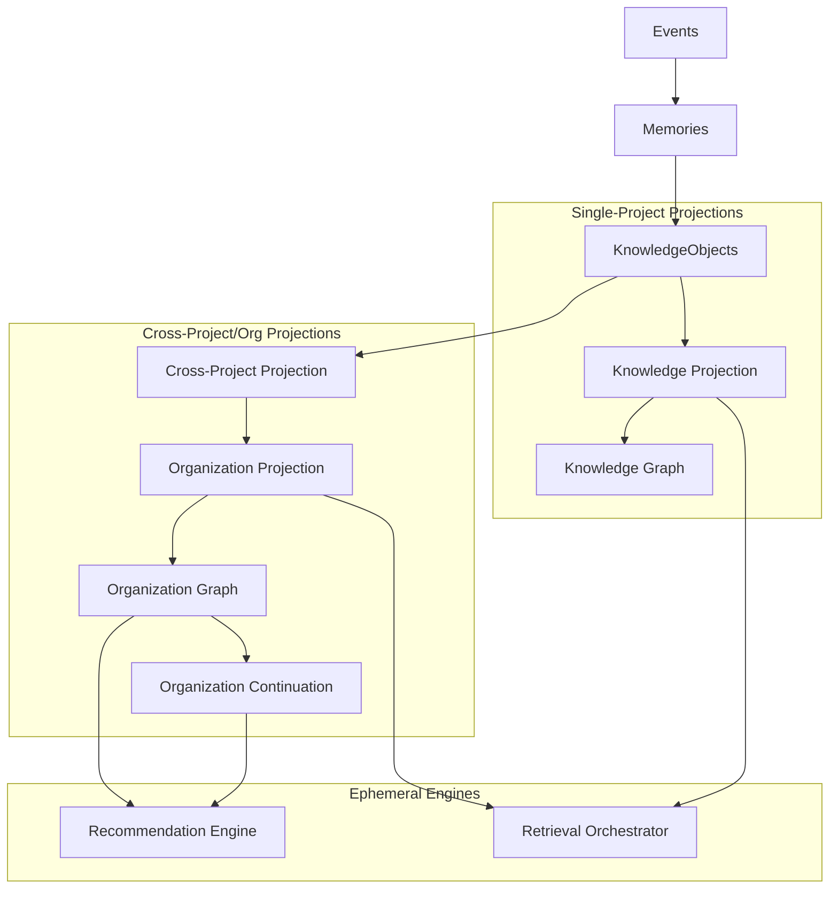

# RationaleVault v1.1.0 Architecture & Release Snapshot

This document serves as a frozen architectural reference point for the **v1.1.0** release of RationaleVault. It catalogs the design principles, implemented subsystems, evaluation baselines, security posture, and performance characteristics at this milestone.

---

## 1. Architectural Principles

RationaleVault adheres to four foundational pillars of cognitive continuity:

1. **State Invariance / Single Source of Truth**: All operations, decisions, and system assertions originate from the immutable Event Ledger.
2. **Deterministic Projections**: Projections (Continuation, Knowledge, Graph, Cross-Project, Organization) are compiled deterministically and are rebuildable at any historical `reference_time`.
3. **Project Isolation**: Solid separation of storage spaces for individual projects, with cross-project data consolidated only at the ephemeral projection and orchestrator/retrieval layers.
4. **Projection Boundary**:
   - **Projections** answer: *"What is true?"* (derived deterministic states).
   - **Engines** answer: *"What should be done?"* (synthesis and decision rules).
   - Neither projections nor engines are persisted. Only **Events**, **Memories**, and **KnowledgeObjects** are sources of truth.

---

## 2. Platform Subsystems Map & Hierarchy

### A. Subsystems List
- **Core State (Mutable Inputs)**:
  - *Events*: Appended monotonically to the Event Ledger (SQLite / PostgreSQL).
  - *Memories*: Semantic units derived from event streams.
  - *KnowledgeObjects*: Structured invariants, constraints, rules, and rulesets.
- **Projections (Derived State)**:
  - *Continuation*: Reconstructs the activity and history of an active project session.
  - *Knowledge*: Synthesizes and groups structural facts.
  - *Knowledge Graph*: Models dependencies and relations within a single project.
  - *Cross-Project*: Resolves read-through visibility across project boundaries.
  - *Organization*: Aggregates multi-repository metadata and activities.
  - *Organization Graph*: Maps cross-project topology with `IN_CLUSTER` and `TRANSFERRED_TO` relations.
  - *Organization Continuation*: Computes cross-project context dynamics and team-level continuation requirements.
- **Ephemeral Engines (Downstream Action)**:
  - *Retrieval Orchestrator*: Multi-strategy contextual retrieval query executor using blend configurations.
  - *Recommendation Engine*: Synthesizes warnings, duplicates, and checklists across repositories.
  - *Exposure Interfaces*: CLI (`rationalevault`) and Model Context Protocol (MCP) server integration.

### B. State Derivation & Flow Hierarchy



---

## 3. Release Significance (v1.0.x vs v1.1.0)

```text
v1.0.x (Project Continuity Platform)
   │
   └── Focus: Single-project event-sourcing, memory consolidation, and CLI query retrieval.
   
v1.1.0 (Organizational Intelligence Platform)
   │
   └── Focus: Cross-project context compilation, cluster topology maps, recommendations, and MCP.
```

### Key Additions in v1.1.0
- **Organization Projection**: Multi-project indexing and registry safety.
- **Organization Graph**: Clustered project topologies and shared relations.
- **Organization Continuation**: Unified team-level development stream insights.
- **Retrieval Orchestrator**: Blend configurations and project sharing rules.
- **Recommendation Engine**: Proactive lint-like checks, duplicate detection, and warning signals.
- **Full Audit Hardening**: Memory isolation, concurrency safety, and deterministic `reference_time` contracts.

---

## 4. Hardening & Audit Remediations

The following vulnerabilities and performance bottlenecks were resolved in Sprint H1:

### Security Fixes
- **CRIT-1: Memory Contamination**: Complete validation of tenant/project boundaries.
- **CRIT-2: Project-Scoped Reads**: Verified that the SQL store layer prevents cross-tenant queries.
- **CRIT-5: Retrieval Bypass**: Isolated shared knowledge discovery using `transferable_only=True` queries.
- **MED-1 & CRIT-6: ID Collisions**: Safe serialization keys using prefixed hashes.
- **Concurrency Locking**: Implemented atomic `os.mkdir`-based write locks during `ProjectRegistry.save()` writes to serialize operations.

### Determinism Framework
- Standardized all projections to accept a optional `reference_time` parameter.
- Centralized date parsing to enforce UTC temporal evaluation.

### Performance & Safety Optimizations
- **Jaccard Complexity**: Reduced Jaccard similarity complexity in the Organization Graph from `O(C * S² * L)` to `O(L + C * S²)` by replacing set union allocations with size arithmetic (`union = a_size + b_size - intersection`).
- **Graph Safety**: Replaced recursive DFS traversals with iterative stack-based loops (`dependency_chain()`, `all_paths()`, `_dfs_cycles()`) to ensure absolute memory safety on deep graph structures.

---

## 5. Non-Goals (v1.1.0)

- **No secondary persistence layers**: No databases or files store the derived projections or recommendation engine outputs.
- **No projection persistence**: Projections are entirely ephemeral and reconstructed on demand.
- **No recommendation persistence**: Recommendations are computed in-memory per invocation and are never saved.
- **No LLM-dependent evaluation**: Verification checks and diagnostic gates are algorithmic and deterministic.
- **No autonomous execution engine**: RationaleVault does not execute code or perform writes autonomously.
- **No workflow scheduler**: Execution is passive and triggered on-demand via the CLI or MCP.
- **No vector database dependency**: Semantic search uses local/embedded search configurations without requiring external vector storage services.

---

## 6. Test History Metrics

```text
Release Milestones
├── I7  (Continuation)   : ~306 tests
├── I8  (Knowledge)      : ~372 tests
├── I9  (Graph)          : ~427 tests
├── I10 (Cross-Project)  : ~495 tests
├── I11 (Organization)   : ~593 tests
├── I12 (Orchestration)  : ~654 tests
├── I13 (Org Graph)      : ~726 tests
├── I14 (Org Continuity) : ~765 tests
├── I15 (Recommendations): ~835 tests
└── H1  (v1.1.0 Release) : 862 tests collected (848 passed, 14 skipped)
```
